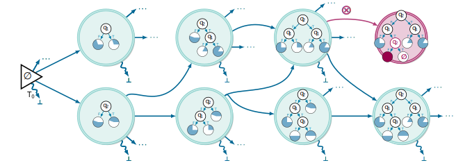

# **Learning Decision Trees as Amortized Structure Inference** #

## **Illustration** ## 
<p align="center">
  
</p>

## **Initial setup** ##
For the inital setup, simply follow these steps: 

````
git clone https://github.com/GFNOrg/dt-gfn.git
cd gfn
pip install -r requirements.txt
````

To setup the cython files, please make sure to run:
````
cd gflownet
python setup.py build_ext --inplace
````

## **Quickstart** ## 
You can train a GFlowNet to sample a single decision tree on the Iris dataset with the following command: 

````
python main.py +experiments=tree_acc
````

To make sure everything works seamlessly, you might want to use the following command for debugging: 
````
HYDRA_FULL_ERROR=1 python main.py +experiments=tree_acc
````

If tree plotting with Graphiz is an issue, either make sure to install it or use the following code:
````
HYDRA_FULL_ERROR=1 python main.py +experiments=tree_acc ++env.test_args.top_k_trees=0
````

